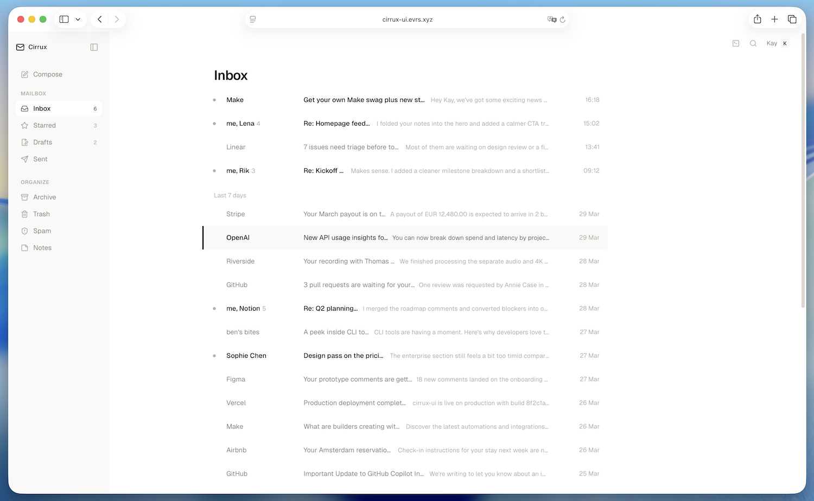

# Cirrux UI Prototype

A personal UI/UX exploration built on top of Cirrux, a European, privacy-first webmail client.

A UI prototype exploring what Cirrux could look like with a more polished design system: same character, more consistency.

## What I focused on

- Spacing and visual rhythm
- Sidebar structure and navigation
- Typography hierarchy
- Hover states and interaction feedback
- Settings as a design system foundation

## Live preview

[View live →](https://cirrux-ui.evrs.xyz/)

## Screenshot

## Notes

This is a prototype, not a production build. Feel free to take whatever is useful, or ignore it entirely.

Built with React + Vite.
